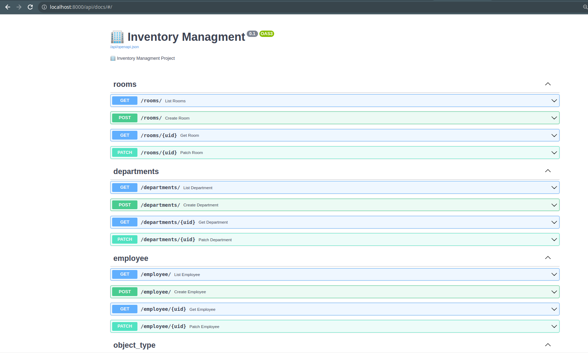

# Inventory managment API
A simple asynchronous API for performing inventory and accounting in your company

## Clone repo
```
git clone https://github.com/IMaG1337/inventory_managment.git
```
## Environment settings

Rename ```.sample_env``` to ```.env``` or create new ```.env``` file <br /> 
Insert your values in ```.env``` file <br />
**```DB_HOST```** must be named as the service databases (db) in the ```docker-compose.yml``` file.<br /> 
If you don't change ```docker-compose.yml``` file it will default to ```DB_HOST=db```

## Docker

Build and up docker container 

### To up docker
```
make up 
```
### To down docker
```
make down 
```

### Done
Now you can check the work docker command: ``` docker-compose -ps ```

If you did everything right you see 2 containers like: <br />
    ```inventory_managment_db_1```<br />    ```inventory_managment_web_1```

API documentation is at (http://localhost:8000/api/docs/#/)

